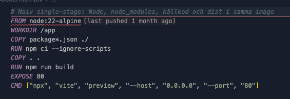

# Containers – Kraftly Mina sidor

## Hur man kör

Från ren klon:

```bash
docker compose up --build
```

Öppna `http://localhost:8080`. Logga in med valfri e-post och lösenord — mock-API:t accepterar alla.

Stoppa:

```bash
docker compose down
```

## Image-storlek

Uppmätt med `docker image ls` (DISK USAGE).


| Image               | Typ                                      | Storlek |
| ------------------- | ---------------------------------------- | ------- |
| `kraftly-naiv`      | Naiv — Node, node_modules, källkod, dist | 371 MB  |
| `kraftly-tesla-web` | Multi-stage — nginx + `dist/`            | 56,6 MB |
| `kraftly-tesla-api` | Mock-API                                 | 198 MB  |


Vi byggde en naiv variant lokalt för att jämföra storlekar och tog bort filen innan merge. Innehållet finns kvar som skärmdump nedan.



## Beslut 1 · Basimage

Vi använder Alpine-baserade images: `node:22-alpine` för bygge och API, `nginx:1.27-alpine` som runtime för frontend. Alpine ger små images. nginx är lämpligt för att servera statiska filer efter Vite-build. Ingen node behövs.

## Beslut 2 · Hur mock-API:t körs

Mock-API:t körs som egen container (`Dockerfile.api`) i `docker compose`, inte manuellt med `npm run api` på hosten. API-containern nås bara internt via Docker-nätverket. Vi installerar produktionsberoenden med `npm ci --omit=dev --ignore-scripts` (husky i `prepare`-scriptet ska inte köras i containern, det märkte vi efter lite errror när vi bara hade med --omit=dev utan ignore scripts).

## Beslut 3 · Hur browsern når API:t

Vi anmvänder en proxy istället för att hårdkoda in URL. Browsern behöer alltså inte nå port 4000 och vi slipper CORS-problem

Körs det lokalt utan Docker (`npm run dev` + `npm run api`) används fortfarande `http://localhost:4000` direkt.

## CI

Jobbet `image` i `.github/workflows/ci.yml` kör:

```bash
docker build -t kraftly .
docker image ls kraftly
```


## Kända begränsningar

- Image är byggd för arm64 - kan bli problem med apple silicon chip
- `depends_on` garanterar inte att API:t hunnit starta innan nginx tar emot trafik, utan bara att containern startar först.
- Port 8080 kan vara upptagen av gamla containers (`docker ps --filter "publish=8080"`).

