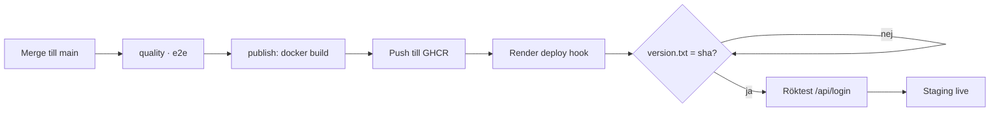

# Deploy – Kraftly Mina sidor

## Flödet

Efter merge till main bygger CI en Docker-image, pushar till GHCR, triggar Render via deploy hook, väntar på version.txt, och kör röktest mot /api/login.

## Miljöer

| Miljö          | URL                                          | Image                                  | API                                        | Uppdateras                               |
| -------------- | -------------------------------------------- | -------------------------------------- | ------------------------------------------ | ---------------------------------------- |
| Lokal (dev)    | `http://localhost:5173`                      | —                                      | mock-API på `:4000` via Vite-proxy         | manuellt (`npm run dev` + `npm run api`) |
| Lokal (Docker) | `http://localhost:8080`                      | byggs lokalt                           | `http://api:4000` internt i compose        | `docker compose up --build`              |
| Staging        | `https://kraftly-tesla-staging.onrender.com` | `ghcr.io/siriprydz/kraftly-tesla:main` | `https://kraftly-api-staging.onrender.com` | automatiskt vid merge till `main`        |
| Prod           | —                                            | —                                      | —                                          | finns inte ännu                          |

## Konfiguration – var bor vad?

| Variabel             | Hemlig?   | Lokalt                           | Staging                                                           | Används av                                              |
| -------------------- | --------- | -------------------------------- | ----------------------------------------------------------------- | ------------------------------------------------------- |
| `API_KEY`            | Ja        | `.env`                           | Render → Environment                                              | Vite-proxy / nginx (skickas som `X-Api-Key` till API:t) |
| `API_URL`            | Nej       | `.env` (`http://localhost:4000`) | Render → Environment (`https://kraftly-api-staging.onrender.com`) | nginx (proxar `/api/`)                                  |
| `PORT`               | Nej       | `80` i compose                   | Render sätter själv                                               | nginx (`listen`)                                        |
| `RENDER_DEPLOY_HOOK` | Ja        | —                                | GitHub → Environment `staging` → Secrets                          | `deploy-staging`-jobbet (triggar Render)                |
| `STAGING_URL`        | Nej       | —                                | GitHub → Environment `staging` → Variables                        | deploy + verifiering (`version.txt`, röktest)           |
| `GITHUB_TOKEN`       | Ja (auto) | —                                | GitHub Actions (inbyggd)                                          | push till GHCR                                          |

## API-nyckeln

Den gamla API-nyckeln roterades, dvs den dödades av backend-teamet (Jonathan). Den fungerar inte längre, därför blir utskriften 401. Den Nya nyckenln ligger i Render som en environment secret och skrivs inte ut någonstans.
Vi valde att inte skriva om historiken. Nyckeln är roterad och därför värdelös nu. Att skriva om historik i ett delat repo med flera aktiva branches och en körande pipeline är en oproportionerlig risk (force-push, trasiga PR:ar, alla måste klona om etc) för en nyckel som redan är värdelös. Eftersom nyckeln inte innehåller någon annan känslig information så valde vi att inte riskera de oönskade konsekvenserna denna gång.

## Rollback

Varje image i GHCR är taggad med sin commit-sha. En rollback är en deploy av en äldre tagg, ingen ny build. Två sätt att göra det. Verifiera alltid via [version.txt](https://kraftly-tesla-staging.onrender.com/version.txt) i browsern.

### GitHub Actions (`rollback.yml`)

Workflowen `.github/workflows/rollback.yml` körs för hand, ingen ny build, bara deploy av `ghcr.io/siriprydz/kraftly-tesla:<sha>`.

1. **GitHub** - Commits - kopiera hela sha:n för commiten du vill tillbaka till
2. Packages - kontrollera att sha:n finns som tagg (bara commits som mergats till `main` och pushats till GHCR finns där. PR:ar och lokala commits saknar tagg)
3. Actions - Rollback staging - Run workflow - klistra in sha:n - Run workflow
4. Vänta tills jobbet är grönt
5. Verifiera: ladda om staging och öppna [version.txt](https://kraftly-tesla-staging.onrender.com/version.txt) ska visa den gamla sha:n

**Tillbaka till nuläget:** kör CI med Run workflow på `main`, eller rollback med senaste sha:n.

`main` ändras inte, bara det som kör i Render.

### Render Dashboard

1. **Render** web service `kraftly-tesla-staging` - Events
2. Hitta en tidigare lyckad deploy - Rollback to this deploy
3. Verifiera: öppna [version.txt](https://kraftly-tesla-staging.onrender.com/version.txt) sha:n ska matcha den deploy du rullade tillbaka till

## Tider (uppmätta)

| Steg                                 | Tid        | Hur                                                                                      |
| ------------------------------------ | ---------- | ---------------------------------------------------------------------------------------- |
| Merge → publish klar                 | 1 min 28 s | `e2e` (50s) + `Image → GHCR` (38s) testjobben körs parallellt, publish väntar på längsta |
| Hook → rätt sha svarar               | ~7 s       | Hela `Deploy → staging`-jobbet (hook + väntan + röktest)                                 |
| Totalt merge → staging live          | 1 min 35 s | 50s + 38s + 7s                                                                           |
| Kallstart (efter 15 min inaktivitet) | ej uppmätt | Mät i browsern: Render + test-API sover                                                  |

## Kända begränsningar

Kallstart tar tid iom att det är ett gratiskonto på Render. Siri äger Render-kontot, så endast hon har tillgång till inställningar där. Än så länge finns bara staging, och ingen produktion live.
