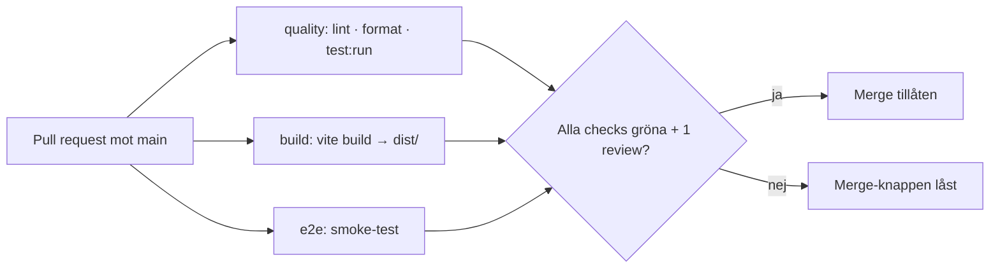
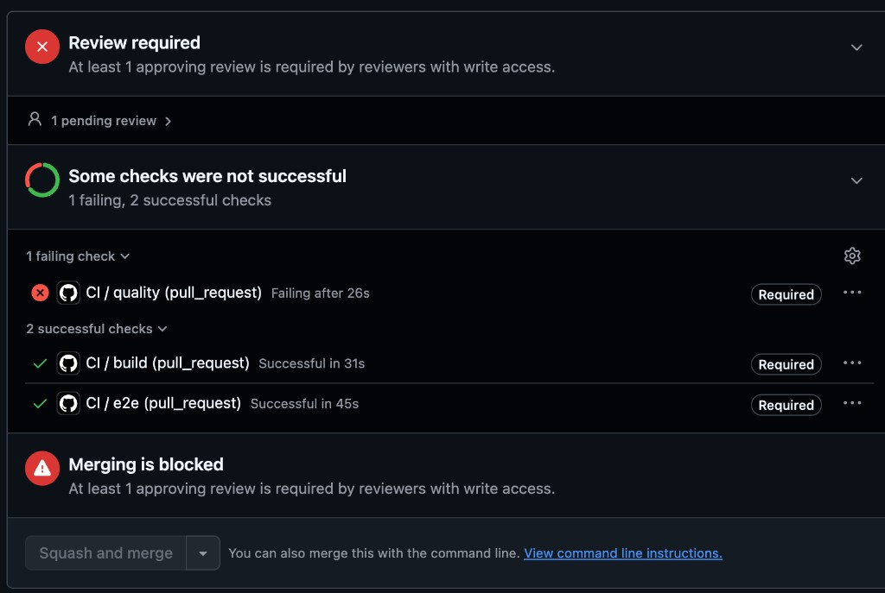

# Pipeline – Kraftly Mina sidor

## Flöde

## Beslut 1 · Jobb: parallellt eller i serie?

Vi valde att köra våra jobb parallellt för att spara körtid i de flesta fall där allt stämmer. Vi resonerade att detta här projektet inte är så pass stort att det spelar någon större roll om jobben körs även om lintingen är fel.

## Beslut 2 · Vad krävs för merge?

Build, Quality och e2e måste alla klaras och minst en kollega behöver godkänna PR innan kod kan mergas in till main. Ingen i teamet har möjlighet att kringgå reglerna.

## Beslut 3 · Protokoll vid röd main

Om main är röd är det "all hands on deck" att fixa så fort som möjligt. Ingen gör nya branches eller mergar innan problemet är löst. I första hand reverta eftersom det är det tryggaste alternativet. Laga frammåt om det är en enkel uppenbar fix.

## Byggtid: före och efter npm-cache

| Steg             | Utan cache | Med cache |
| ---------------- | ---------- | --------- |
| npm ci (quality) | 17s        | 12s       |
| npm ci (build)   | 18s        | 11s       |
| Hela körningen   | 37s        | 29s       |

## Cypress Cache

Vi provade lägga till cypress-io/github-action@v6 för cypress cache men kom fram till att det i detta fall gjorde e2e-jobbet långsammare. Vi dokumenterade körtiden i tabellen nedan.

| Körning | Total tid | `cypress-io/github-action@v6` |
| ------- | --------- | ----------------------------- |
| 1       | 40s       | 36s                           |
| 2       | 50s       | 40s                           |
| 3       | 55s       | 46s                           |
| 4       | 53s       | 40s                           |
| 5       | 47s       | 41s                           |

## Skärmdump: låst merge-knapp

PR #31 med ett medvetet lintfel (`var` istället för `const` i `src/utils/date.js`).
`quality` fallerar på `npm run lint`, medan `build` och `e2e` går igenom. Alla tre är
markerade `Required`, och merge-knappen är låst.

